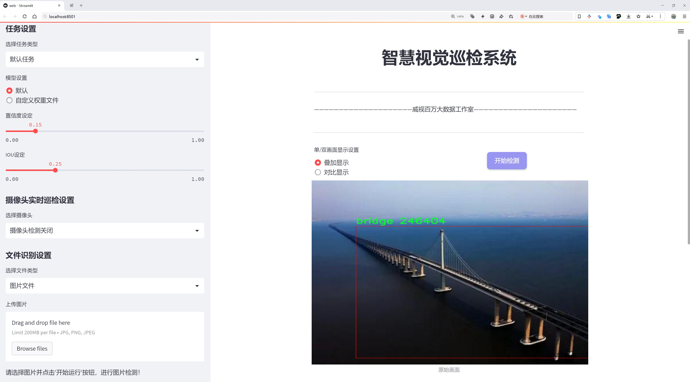
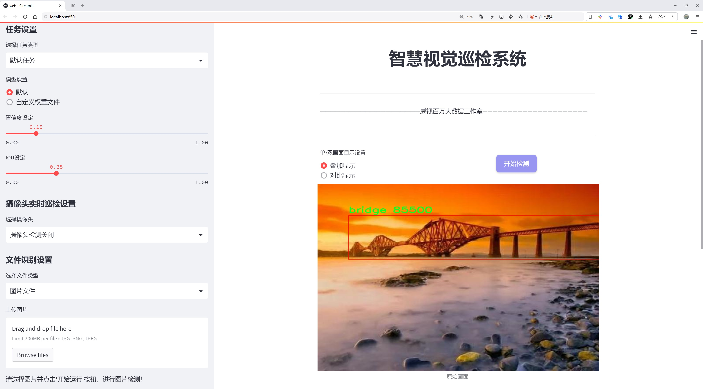
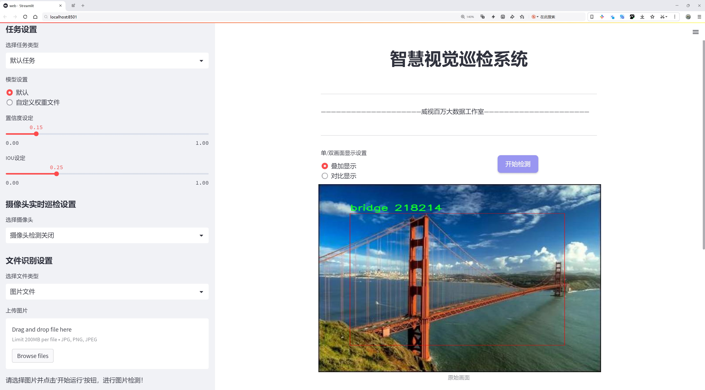
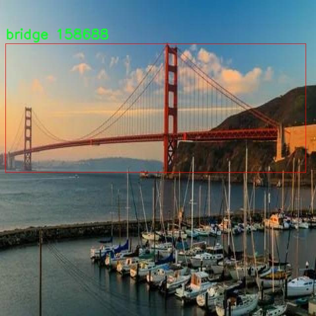
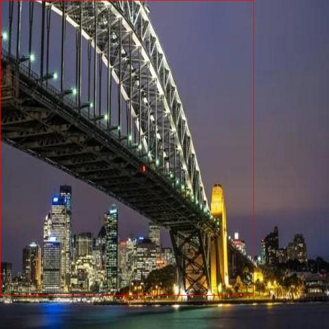
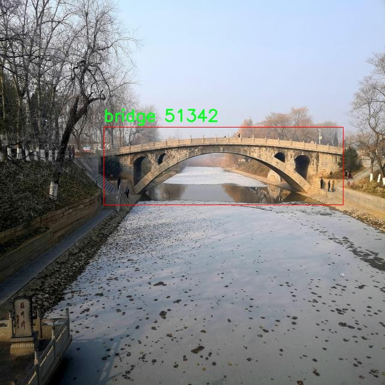
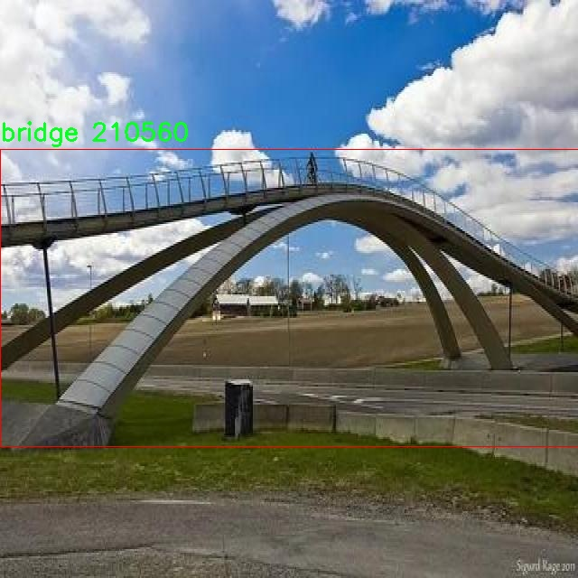
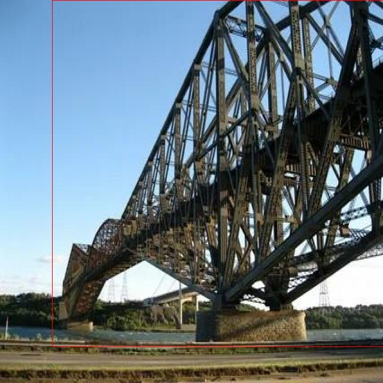

# 桥梁检测系统源码分享
 # [一条龙教学YOLOV8标注好的数据集一键训练_70+全套改进创新点发刊_Web前端展示]

### 1.研究背景与意义

项目参考[AAAI Association for the Advancement of Artificial Intelligence](https://gitee.com/qunmasj/projects)

项目来源[AACV Association for the Advancement of Computer Vision](https://kdocs.cn/l/cszuIiCKVNis)

研究背景与意义

随着城市化进程的加快，桥梁作为重要的交通基础设施，其安全性和可靠性日益受到关注。桥梁的损坏和老化不仅影响交通流畅性，还可能对人们的生命财产安全造成严重威胁。因此，及时、准确地检测和评估桥梁的结构状态显得尤为重要。传统的桥梁检测方法主要依赖人工巡检和目视检查，这种方式不仅耗时耗力，而且容易受到人为因素的影响，导致检测结果的主观性和不准确性。为了解决这一问题，近年来，基于计算机视觉和深度学习的自动化检测技术逐渐成为研究热点。

YOLO（You Only Look Once）系列模型因其高效的实时目标检测能力而受到广泛关注。YOLOv8作为该系列的最新版本，进一步提升了检测精度和速度，尤其适用于复杂环境下的目标检测任务。通过改进YOLOv8模型，结合桥梁检测的具体需求，可以有效提高桥梁检测的自动化水平和准确性。本研究旨在构建一个基于改进YOLOv8的桥梁检测系统，以实现对桥梁结构的智能化监测。

本研究所使用的数据集“bridge1”包含1100张桥梁图像，且类别数量为1，专注于桥梁这一特定目标。这一数据集的构建为模型的训练和测试提供了良好的基础。尽管数据集的规模相对较小，但其专一性和针对性使得模型能够更集中地学习桥梁的特征，进而提高检测的精度。通过对数据集的深入分析和处理，可以挖掘出更多的桥梁特征信息，从而为模型的改进提供支持。

改进YOLOv8模型的研究不仅具有理论意义，还具有重要的实际应用价值。首先，基于深度学习的桥梁检测系统能够大幅提高检测效率，减少人工成本，尤其在大规模桥梁监测中，自动化检测系统的应用将显著提升工作效率。其次，准确的桥梁检测结果能够为桥梁的维护和管理提供科学依据，帮助相关部门及时发现潜在的安全隐患，制定合理的维护策略，延长桥梁的使用寿命。此外，该系统的成功应用还可以为其他基础设施的检测提供借鉴，推动智能监测技术在更广泛领域的应用。

综上所述，基于改进YOLOv8的桥梁检测系统的研究不仅能够推动桥梁检测技术的发展，还将为城市基础设施的安全管理提供新的解决方案。通过深入探讨和实现这一系统，我们期望能够为桥梁安全监测领域带来新的突破，促进智能交通和智慧城市的建设，为社会的可持续发展贡献力量。

### 2.图片演示







##### 注意：由于此博客编辑较早，上面“2.图片演示”和“3.视频演示”展示的系统图片或者视频可能为老版本，新版本在老版本的基础上升级如下：（实际效果以升级的新版本为准）

  （1）适配了YOLOV8的“目标检测”模型和“实例分割”模型，通过加载相应的权重（.pt）文件即可自适应加载模型。

  （2）支持“图片识别”、“视频识别”、“摄像头实时识别”三种识别模式。

  （3）支持“图片识别”、“视频识别”、“摄像头实时识别”三种识别结果保存导出，解决手动导出（容易卡顿出现爆内存）存在的问题，识别完自动保存结果并导出到tempDir中。

  （4）支持Web前端系统中的标题、背景图等自定义修改，后面提供修改教程。

  另外本项目提供训练的数据集和训练教程,暂不提供权重文件（best.pt）,需要您按照教程进行训练后实现图片演示和Web前端界面演示的效果。

### 3.视频演示

[3.1 视频演示](https://www.bilibili.com/video/BV1ZZ12YUEw6/)

### 4.数据集信息展示

##### 4.1 本项目数据集详细数据（类别数＆类别名）

nc: 1
names: ['bridge']


##### 4.2 本项目数据集信息介绍

数据集信息展示

在现代桥梁工程和交通管理中，桥梁的安全性和完好性至关重要。为了提升桥梁检测的效率和准确性，研究人员开发了一种基于YOLOv8的桥梁检测系统。本研究所使用的数据集名为“bridge1”，该数据集专门为桥梁检测任务而设计，旨在为模型训练提供高质量的标注数据。

“bridge1”数据集的类别数量为1，具体类别为“bridge”。这一设计使得数据集的目标明确，专注于桥梁这一特定对象的检测。通过将所有的样本集中在单一类别上，研究者能够更好地优化模型的学习过程，从而提高其在桥梁检测任务中的表现。尽管类别数量较少，但数据集的构建却注重多样性和代表性，确保包含不同类型、不同环境和不同状态的桥梁图像。这种多样性不仅增强了模型的泛化能力，也使其能够适应各种实际应用场景。

数据集“bridge1”包含了大量的桥梁图像，这些图像来自于不同的地理位置和环境条件，涵盖了城市桥梁、乡村桥梁以及不同材料和结构形式的桥梁。这些图像在拍摄时考虑了多种光照条件和天气变化，确保模型在各种情况下都能保持良好的检测性能。此外，数据集中还包括了不同角度和距离拍摄的桥梁图像，进一步丰富了训练数据的多样性。

为了确保数据集的高质量，所有图像均经过严格的标注过程。标注团队由经验丰富的工程师和专业人员组成，他们对每一张图像中的桥梁进行了精准的标注，确保数据集的准确性和可靠性。这一过程不仅包括对桥梁的边界框标注，还考虑了桥梁的特征，如桥梁的类型、结构和损坏情况等。这样的细致标注为后续的模型训练提供了坚实的基础，使得YOLOv8能够有效地学习到桥梁的特征和模式。

在模型训练过程中，研究者将“bridge1”数据集与YOLOv8的先进算法相结合，利用其强大的特征提取能力和实时检测性能，旨在实现高效的桥梁检测。通过不断迭代和优化，研究者希望能够提升模型在实际应用中的表现，尤其是在桥梁的实时监测和维护方面。

总之，数据集“bridge1”不仅为YOLOv8的桥梁检测系统提供了必要的训练基础，还通过其丰富的样本和精准的标注，助力于提升桥梁检测的智能化水平。随着技术的不断进步和数据集的持续完善，未来的桥梁检测系统将能够更好地服务于交通安全和基础设施的维护，为社会的可持续发展贡献力量。











### 5.全套项目环境部署视频教程（零基础手把手教学）

[5.1 环境部署教程链接（零基础手把手教学）](https://www.ixigua.com/7404473917358506534?logTag=c807d0cbc21c0ef59de5)


[5.2 安装Python虚拟环境创建和依赖库安装视频教程链接（零基础手把手教学）](https://www.ixigua.com/7404474678003106304?logTag=1f1041108cd1f708b01a)

### 6.手把手YOLOV8训练视频教程（零基础小白有手就能学会）

[6.1 手把手YOLOV8训练视频教程（零基础小白有手就能学会）](https://www.ixigua.com/7404477157818401292?logTag=d31a2dfd1983c9668658)


按照上面的训练视频教程链接加载项目提供的数据集，运行train.py即可开始训练



     Epoch   gpu_mem       box       obj       cls    labels  img_size
     1/200     20.8G   0.01576   0.01955  0.007536        22      1280: 100%|██████████| 849/849 [14:42<00:00,  1.04s/it]
               Class     Images     Labels          P          R     mAP@.5 mAP@.5:.95: 100%|██████████| 213/213 [01:14<00:00,  2.87it/s]
                 all       3395      17314      0.994      0.957      0.0957      0.0843

     Epoch   gpu_mem       box       obj       cls    labels  img_size
     2/200     20.8G   0.01578   0.01923  0.007006        22      1280: 100%|██████████| 849/849 [14:44<00:00,  1.04s/it]
               Class     Images     Labels          P          R     mAP@.5 mAP@.5:.95: 100%|██████████| 213/213 [01:12<00:00,  2.95it/s]
                 all       3395      17314      0.996      0.956      0.0957      0.0845

     Epoch   gpu_mem       box       obj       cls    labels  img_size
     3/200     20.8G   0.01561    0.0191  0.006895        27      1280: 100%|██████████| 849/849 [10:56<00:00,  1.29it/s]
               Class     Images     Labels          P          R     mAP@.5 mAP@.5:.95: 100%|███████   | 187/213 [00:52<00:00,  4.04it/s]
                 all       3395      17314      0.996      0.957      0.0957      0.0845


### 7.70+种全套YOLOV8创新点代码加载调参视频教程（一键加载写好的改进模型的配置文件）

[7.1 70+种全套YOLOV8创新点代码加载调参视频教程（一键加载写好的改进模型的配置文件）](https://www.ixigua.com/7404478314661806627?logTag=29066f8288e3f4eea3a4)

### 8.70+种全套YOLOV8创新点原理讲解（非科班也可以轻松写刊发刊，V10版本正在科研待更新）

#### 由于篇幅限制，每个创新点的具体原理讲解就不一一展开，具体见下列网址中的创新点对应子项目的技术原理博客网址【Blog】：


[8.1 70+种全套YOLOV8创新点原理讲解链接](https://gitee.com/qunmasj/good)

#### 部分改进原理讲解(完整的改进原理见上图和技术博客链接)
### YOLOv8简介
YOLOv8 尚未发表论文，因此我们无法直接了解其创建过程中进行的直接研究方法和消融研究。话虽如此，我们分析了有关模型的存储库和可用信息，以开始记录 YOLOv8 中的新功能。

如果您想自己查看代码，请查看YOLOv8 存储库并查看此代码差异以了解一些研究是如何完成的。

在这里，我们提供了有影响力的模型更新的快速总结，然后我们将查看模型的评估，这不言自明。

GitHub 用户 RangeKing 制作的下图显示了网络架构的详细可视化。


在这里插入图片描述


在这里插入图片描述

YOLOv8 架构，GitHub 用户 RangeKing 制作的可视化

无锚检测
YOLOv8 是一个无锚模型。这意味着它直接预测对象的中心而不是已知锚框的偏移量。


YOLO中anchor box的可视化

锚框是早期 YOLO 模型中众所周知的棘手部分，因为它们可能代表目标基准框的分布，而不是自定义数据集的分布。


YOLOv8 的检测头，在netron.app中可视化

Anchor free 检测减少了框预测的数量，从而加速了非最大抑制 (NMS)，这是一个复杂的后处理步骤，在推理后筛选候选检测。


YOLOv8 的检测头，在netron.app中可视化

新的卷积
stem 的第一个6x6conv 被替换为 a 3x3，主要构建块被更改，并且C2f替换了C3。该模块总结如下图，其中“f”是特征数，“e”是扩展率，CBS是由a Conv、a BatchNorm、a组成的block SiLU。

在中， （两个具有剩余连接的 3x3C2f的奇特名称）的所有输出都被连接起来。而在仅使用最后一个输出。Bottleneck``convs``C3``Bottleneck


新的 YOLOv8C2f模块

这Bottleneck与 YOLOv5 中的相同，但第一个 conv 的内核大小从更改1x1为3x3. 从这些信息中，我们可以看到 YOLOv8 开始恢复到 2015 年定义的 ResNet 块。

在颈部，特征直接连接而不强制使用相同的通道尺寸。这减少了参数数量和张量的整体大小。

### 空间和通道重建卷积SCConv
参考该博客提出的一种高效的卷积模块，称为SCConv (spatial and channel reconstruction convolution)，以减少冗余计算并促进代表性特征的学习。提出的SCConv由空间重构单元(SRU)和信道重构单元(CRU)两个单元组成。

（1）SRU根据权重分离冗余特征并进行重构，以抑制空间维度上的冗余，增强特征的表征。

（2）CRU采用分裂变换和融合策略来减少信道维度的冗余以及计算成本和存储。

（3）SCConv是一种即插即用的架构单元，可直接用于替代各种卷积神经网络中的标准卷积。实验结果表明，scconvo嵌入模型能够通过减少冗余特征来获得更好的性能，并且显著降低了复杂度和计算成本。


SCConv如图所示，它由两个单元组成，空间重建单元(SRU)和通道重建单元(CRU)，以顺序的方式放置。具体而言，对于瓶颈残差块中的中间输入特征X，首先通过SRU运算获得空间细化特征Xw，然后利用CRU运算获得信道细化特征Y。SCConv模块充分利用了特征之间的空间冗余和通道冗余，可以无缝集成到任何CNN架构中，以减少中间特征映射之间的冗余并增强CNN的特征表示。

#### SRU单元用于空间冗余


为了利用特征的空间冗余，引入了空间重构单元(SRU)，如图2所示，它利用了分离和重构操作。

分离操作 的目的是将信息丰富的特征图与空间内容对应的信息较少的特征图分离开来。我们利用组归一化(GN)层中的比例因子来评估不同特征图的信息内容。具体来说，给定一个中间特征映射X∈R N×C×H×W，首先通过减去平均值µ并除以标准差σ来标准化输入特征X，如下所示:


其中µ和σ是X的均值和标准差，ε是为了除法稳定性而加入的一个小的正常数，γ和β是可训练的仿射变换。

GN层中的可训练参数\gamma \in R^{C}用于测量每个批次和通道的空间像素方差。更丰富的空间信息反映了空间像素的更多变化，从而导致更大的γ。归一化相关权重W_{\gamma} \in R^{C}由下面公式2得到，表示不同特征映射的重要性。


然后将经Wγ重新加权的特征映射的权值通过sigmoid函数映射到(0,1)范围，并通过阈值进行门控。我们将阈值以上的权重设置为1，得到信息权重W1，将其设置为0，得到非信息权重W2(实验中阈值设置为0.5)。获取W的整个过程可以用公式表示。


最后将输入特征X分别乘以W1和W2，得到两个加权特征:信息量较大的特征X_{1}^{\omega }和信息量较小的特征X_{2}^{\omega }。这样就成功地将输入特征分为两部分:X_{1}^{\omega }具有信息量和表达性的空间内容，而X_{2}^{\omega }几乎没有信息，被认为是冗余的。

重构操作 将信息丰富的特征与信息较少的特征相加，生成信息更丰富的特征，从而节省空间空间。采用交叉重构运算，将加权后的两个不同的信息特征充分结合起来，加强它们之间的信息流。然后将交叉重构的特征X^{\omega1}和X^{\omega2}进行拼接，得到空间精细特征映射X^{\omega}。从后过程表示如下：


其中⊗是逐元素的乘法，⊕是逐元素的求和，∪是串联。将SRU应用于中间输入特征X后，不仅将信息特征与信息较少的特征分离，而且对其进行重构，增强代表性特征，抑制空间维度上的冗余特征。然而，空间精细特征映射X^{\omega}在通道维度上仍然是冗余的。

#### CRU单元用于通道冗余


分割 操作将输入的空间细化特征X^{\omega}分割成两个部分，一部分通道数是\alpha C，另一部分通道数是(1-\alpha) C，随后对两组特征的通道数使用1 * 1卷积核进行压缩，分别得到X_{up}和X_{low}。

转换 操作将输入的X_{up}作为“富特征提取”的输入，分别进行GWC和PWC，然后相加得到输出Y1，将输入X_{low}作为“富特征提取”的补充，进行PWC，得到的记过和原来的输入取并集得到Y2。

融合 操作使用简化的SKNet方法来自适应合并Y1和Y2。具体说是首先使用全局平均池化将全局空间信息和通道统计信息结合起来，得到经过池化的S1和S2。然后对S1和S2做Softmax得到特征权重向量\beta _{1}和\beta _{2}，最后使用特征权重向量得到输出Y = \beta _{1}*Y_{1} + \beta _{2}*Y_{2}，Y即为通道提炼的特征。


### 9.系统功能展示（检测对象为举例，实际内容以本项目数据集为准）

图9.1.系统支持检测结果表格显示

  图9.2.系统支持置信度和IOU阈值手动调节

  图9.3.系统支持自定义加载权重文件best.pt(需要你通过步骤5中训练获得)

  图9.4.系统支持摄像头实时识别

  图9.5.系统支持图片识别

  图9.6.系统支持视频识别

  图9.7.系统支持识别结果文件自动保存

  图9.8.系统支持Excel导出检测结果数据


### 10.原始YOLOV8算法原理

原始YOLOv8算法原理

YOLOv8（You Only Look Once version 8）是由Ultralytics公司于2023年1月10日发布的最新目标检测算法版本，基于YOLOv7进行了显著的优化和改进。作为一种基于卷积神经网络（CNN）的目标检测算法，YOLOv8在设计上旨在通过直接在整个图像上进行目标检测和定位，消除传统方法中滑动窗口和区域提议的复杂性，从而实现更高的检测精度和速度。

YOLOv8的核心原理在于其深度卷积神经网络结构的设计。与前几代YOLO模型相比，YOLOv8采用了更深的网络架构，允许其在特征提取阶段捕捉到更丰富的上下文信息。这种深度网络的引入，使得YOLOv8在处理复杂场景时，能够更好地识别和定位不同类别的目标。此外，YOLOv8引入了多尺度训练和测试的策略，这意味着模型在训练过程中能够接触到不同尺寸的目标，从而提高了其在实际应用中的鲁棒性。

在YOLOv8中，特征金字塔网络（FPN）和路径聚合网络（PAN）被用来优化特征融合过程。FPN的引入使得模型能够有效地从不同层次提取特征，并将这些特征进行融合，以增强对小目标的检测能力。而PAN则通过在特征融合过程中引入上下文信息，进一步提升了目标检测的准确性。这种多层次的特征提取和融合策略，使得YOLOv8在面对复杂背景和遮挡情况时，依然能够保持较高的检测性能。

YOLOv8还特别关注模型的轻量化设计，推出了多个版本，包括YOLOv8n等。轻量化的YOLOv8n模型通过使用更高效的C2F模块替代传统的C3模块，显著减少了计算复杂度和内存占用。这种设计不仅提高了模型的运行速度，还降低了对硬件资源的需求，使得YOLOv8能够在移动设备和边缘计算平台上高效运行。

在检测头的设计上，YOLOv8采用了轻量化的解耦头替换了传统的耦合头，这一创新使得模型在处理目标检测时能够更灵活地应对不同类型的目标。通过有错目标检测的方式，YOLOv8能够更准确地定位目标边界，并减少误检和漏检的发生。这种改进使得YOLOv8在实际应用中表现出色，尤其是在智能监控、自动驾驶和人脸识别等领域。

值得一提的是，YOLOv8在性能上也有了显著提升。与SSD等传统目标检测算法相比，YOLOv8在精度（mAP）上提高了43.23%，而帧率则提升了10.28倍。这一性能的提升，使得YOLOv8不仅能够在静态图像中进行高效的目标检测，也能够在实时视频流中保持高帧率的检测能力，满足了现代应用对速度和准确性的双重需求。

总的来说，YOLOv8算法通过其深度卷积神经网络结构、多尺度训练与测试、特征金字塔网络和路径聚合网络的结合，以及轻量化设计的实现，极大地提升了目标检测的性能。其在各类应用场景中的广泛适用性，尤其是在对实时性和准确性要求较高的领域，使得YOLOv8成为当前目标检测领域的一个重要里程碑。随着YOLOv8的推广和应用，未来的目标检测技术将会更加智能化和高效化，为各行各业的智能化发展提供强有力的支持。


### 11.项目核心源码讲解（再也不用担心看不懂代码逻辑）

#### 11.1 70+种YOLOv8算法改进源码大全和调试加载训练教程（非必要）\ultralytics\models\yolo\__init__.py

下面是对给定代码的核心部分进行提炼和详细注释的结果：

```python
# 导入Ultralytics YOLO库中的不同模型功能
from ultralytics.models.yolo import classify, detect, pose, segment

# 从当前模块导入YOLO类
from .model import YOLO

# 定义当前模块公开的接口，包含分类、检测、姿态估计、分割功能以及YOLO类
__all__ = 'classify', 'segment', 'detect', 'pose', 'YOLO'
```

### 代码分析与注释：

1. **导入YOLO模型功能**：
   ```python
   from ultralytics.models.yolo import classify, detect, pose, segment
   ```
   - 这一行代码从`ultralytics.models.yolo`模块中导入了四个主要功能：
     - `classify`：用于图像分类的功能。
     - `detect`：用于目标检测的功能。
     - `pose`：用于姿态估计的功能。
     - `segment`：用于图像分割的功能。
   - 这些功能是YOLO（You Only Look Once）模型的核心应用，适用于计算机视觉任务。

2. **导入YOLO类**：
   ```python
   from .model import YOLO
   ```
   - 这一行代码从当前模块的`model`文件中导入了`YOLO`类。
   - `YOLO`类通常包含模型的初始化、训练、推理等方法，是使用YOLO模型的主要接口。

3. **定义模块公开接口**：
   ```python
   __all__ = 'classify', 'segment', 'detect', 'pose', 'YOLO'
   ```
   - `__all__`是一个特殊变量，用于定义当使用`from module import *`时，哪些名称会被导入。
   - 在这里，定义了模块可以公开的功能和类，包括图像分类、目标检测、姿态估计、图像分割功能以及`YOLO`类。
   - 这有助于模块的使用者了解可以使用哪些功能，同时也有助于封装和管理模块的接口。

### 总结：
以上代码主要用于导入YOLO模型的核心功能和类，并定义了模块的公开接口。通过这些功能，用户可以方便地进行图像分类、目标检测、姿态估计和图像分割等计算机视觉任务。

这个文件是Ultralytics YOLO项目中的一个初始化文件，通常用于模块的组织和导入。在Python中，`__init__.py`文件的存在使得包含该文件的目录被视为一个包，从而可以在其他地方导入该包中的模块和类。

在这个文件中，首先通过注释标明了该项目的名称“Ultralytics YOLO”以及其使用的许可证类型（AGPL-3.0）。接着，文件从`ultralytics.models.yolo`模块中导入了四个功能：`classify`（分类）、`detect`（检测）、`pose`（姿态估计）和`segment`（分割）。这些功能分别对应YOLO模型在不同任务中的应用，表明该模块支持多种计算机视觉任务。

此外，文件还从当前目录下的`model`模块中导入了`YOLO`类，这可能是YOLO模型的核心实现，负责模型的构建和推理。

最后，`__all__`变量被定义为一个元组，包含了可以通过`from module import *`语句导入的公共接口。这意味着当用户导入这个包时，只有`classify`、`segment`、`detect`、`pose`和`YOLO`这些名称会被导入，从而帮助控制模块的公共API，避免不必要的名称冲突。

总的来说，这个`__init__.py`文件的作用是组织YOLO相关功能的导入，使得用户可以方便地使用YOLO模型进行各种计算机视觉任务。

#### 11.2 ui.py

```python
import sys
import subprocess

def run_script(script_path):
    """
    使用当前 Python 环境运行指定的脚本。

    Args:
        script_path (str): 要运行的脚本路径

    Returns:
        None
    """
    # 获取当前 Python 解释器的路径
    python_path = sys.executable

    # 构建运行命令，使用 streamlit 运行指定的脚本
    command = f'"{python_path}" -m streamlit run "{script_path}"'

    # 执行命令
    result = subprocess.run(command, shell=True)
    # 检查命令执行结果，如果返回码不为0，则表示出错
    if result.returncode != 0:
        print("脚本运行出错。")

# 实例化并运行应用
if __name__ == "__main__":
    # 指定要运行的脚本路径
    script_path = "web.py"  # 假设脚本在当前目录下

    # 运行脚本
    run_script(script_path)
```

### 代码核心部分注释：

1. **导入模块**：
   - `sys`：用于访问与 Python 解释器紧密相关的变量和函数。
   - `subprocess`：用于执行外部命令。

2. **`run_script` 函数**：
   - 定义一个函数，接受一个参数 `script_path`，表示要运行的 Python 脚本的路径。
   - 使用 `sys.executable` 获取当前 Python 解释器的路径，以确保在正确的环境中运行脚本。
   - 构建一个命令字符串，使用 `streamlit` 模块运行指定的脚本。
   - 使用 `subprocess.run` 执行构建的命令，并通过 `shell=True` 允许在 shell 中执行命令。
   - 检查命令的返回码，如果不为0，表示脚本运行出错，打印错误信息。

3. **主程序入口**：
   - 使用 `if __name__ == "__main__":` 确保只有在直接运行该脚本时才会执行以下代码。
   - 指定要运行的脚本路径（这里假设脚本名为 `web.py`）。
   - 调用 `run_script` 函数，传入脚本路径以执行该脚本。

这个程序文件的主要功能是通过当前的 Python 环境来运行一个指定的脚本，具体是使用 Streamlit 框架来启动一个 Web 应用。程序首先导入了必要的模块，包括 `sys`、`os` 和 `subprocess`，这些模块分别用于获取系统信息、处理文件路径和执行外部命令。

在文件中定义了一个名为 `run_script` 的函数，该函数接受一个参数 `script_path`，这个参数是要运行的脚本的路径。函数内部首先获取当前 Python 解释器的路径，使用 `sys.executable` 来实现。接着，构建一个命令字符串，格式为 `"{python_path}" -m streamlit run "{script_path}"`，这个命令会调用 Streamlit 来运行指定的脚本。

随后，使用 `subprocess.run` 方法来执行这个命令。`shell=True` 参数允许在 shell 中执行命令。执行完命令后，程序会检查返回的状态码，如果状态码不为 0，表示脚本运行出错，程序会输出相应的错误信息。

在文件的最后部分，使用 `if __name__ == "__main__":` 语句来确保当该文件作为主程序运行时，以下代码才会被执行。这里指定了要运行的脚本路径为 `web.py`，并调用 `run_script` 函数来启动这个脚本。

总的来说，这个程序文件的作用是方便用户通过命令行运行一个基于 Streamlit 的 Web 应用，且在执行过程中能够处理可能出现的错误。

#### 11.3 code\ultralytics\data\augment.py

以下是经过简化并添加详细中文注释的核心代码部分：

```python
import random
import numpy as np
import cv2

class BaseMixTransform:
    """
    基础混合变换类，用于实现MixUp和Mosaic数据增强。
    """

    def __init__(self, dataset, pre_transform=None, p=0.0) -> None:
        """
        初始化BaseMixTransform对象。

        参数：
            dataset: 数据集对象。
            pre_transform: 预处理变换。
            p: 应用混合变换的概率。
        """
        self.dataset = dataset
        self.pre_transform = pre_transform
        self.p = p

    def __call__(self, labels):
        """
        应用预处理变换和混合变换到标签数据。

        参数：
            labels: 标签字典，包含图像和实例信息。

        返回：
            labels: 经过变换的标签字典。
        """
        if random.uniform(0, 1) > self.p:
            return labels  # 根据概率决定是否应用变换

        # 获取其他图像的索引
        indexes = self.get_indexes()
        if isinstance(indexes, int):
            indexes = [indexes]

        # 获取用于Mosaic或MixUp的图像信息
        mix_labels = [self.dataset.get_image_and_label(i) for i in indexes]

        if self.pre_transform is not None:
            for i, data in enumerate(mix_labels):
                mix_labels[i] = self.pre_transform(data)  # 应用预处理变换
        labels["mix_labels"] = mix_labels

        # 应用Mosaic或MixUp变换
        labels = self._mix_transform(labels)
        labels.pop("mix_labels", None)  # 移除临时混合标签
        return labels

    def _mix_transform(self, labels):
        """应用MixUp或Mosaic增强到标签字典。"""
        raise NotImplementedError

    def get_indexes(self):
        """获取用于Mosaic增强的随机索引列表。"""
        raise NotImplementedError


class Mosaic(BaseMixTransform):
    """
    Mosaic增强类，通过将多个图像组合成一个马赛克图像来实现数据增强。
    """

    def __init__(self, dataset, imgsz=640, p=1.0, n=4):
        """
        初始化Mosaic对象。

        参数：
            dataset: 数据集对象。
            imgsz: 单个图像在马赛克中的大小。
            p: 应用Mosaic增强的概率。
            n: 网格大小，4表示2x2，9表示3x3。
        """
        assert 0 <= p <= 1.0, f"概率应在[0, 1]范围内，但得到{p}。"
        assert n in (4, 9), "网格大小必须为4或9。"
        super().__init__(dataset=dataset, p=p)
        self.imgsz = imgsz
        self.n = n

    def get_indexes(self, buffer=True):
        """返回数据集中随机索引的列表。"""
        if buffer:  # 从缓冲区选择图像
            return random.choices(list(self.dataset.buffer), k=self.n - 1)
        else:  # 随机选择图像
            return [random.randint(0, len(self.dataset) - 1) for _ in range(self.n - 1)]

    def _mix_transform(self, labels):
        """应用Mosaic增强到输入图像和标签。"""
        return self._mosaic4(labels) if self.n == 4 else self._mosaic9(labels)

    def _mosaic4(self, labels):
        """创建一个2x2的图像马赛克。"""
        mosaic_labels = []
        s = self.imgsz
        img4 = np.full((s * 2, s * 2, 3), 114, dtype=np.uint8)  # 创建基础图像

        for i in range(4):
            labels_patch = labels if i == 0 else labels["mix_labels"][i - 1]
            img = labels_patch["img"]
            h, w = labels_patch.pop("resized_shape")

            # 计算图像在马赛克中的位置
            if i == 0:  # 左上角
                x1, y1, x2, y2 = 0, 0, w, h
            elif i == 1:  # 右上角
                x1, y1, x2, y2 = s, 0, s + w, h
            elif i == 2:  # 左下角
                x1, y1, x2, y2 = 0, s, w, s + h
            elif i == 3:  # 右下角
                x1, y1, x2, y2 = s, s, s + w, s + h

            img4[y1:y2, x1:x2] = img  # 将图像放入马赛克中
            mosaic_labels.append(labels_patch)

        final_labels = self._cat_labels(mosaic_labels)
        final_labels["img"] = img4  # 将马赛克图像返回
        return final_labels

    def _cat_labels(self, mosaic_labels):
        """返回包含马赛克边界实例的标签。"""
        cls = []
        instances = []
        for labels in mosaic_labels:
            cls.append(labels["cls"])
            instances.append(labels["instances"])
        # 最终标签
        final_labels = {
            "cls": np.concatenate(cls, 0),
            "instances": Instances.concatenate(instances, axis=0),
        }
        return final_labels


class RandomFlip:
    """
    随机水平或垂直翻转图像的类。
    """

    def __init__(self, p=0.5, direction="horizontal") -> None:
        """
        初始化RandomFlip对象。

        参数：
            p: 应用翻转的概率。
            direction: 翻转方向，支持'horizontal'或'vertical'。
        """
        assert direction in ["horizontal", "vertical"], f"支持方向为'horizontal'或'vertical'，但得到{direction}"
        assert 0 <= p <= 1.0

        self.p = p
        self.direction = direction

    def __call__(self, labels):
        """
        应用随机翻转到图像，并相应更新实例。

        参数：
            labels: 包含图像和实例的字典。

        返回：
            labels: 更新后的字典。
        """
        img = labels["img"]
        if self.direction == "vertical" and random.random() < self.p:
            img = np.flipud(img)  # 垂直翻转
        if self.direction == "horizontal" and random.random() < self.p:
            img = np.fliplr(img)  # 水平翻转
        labels["img"] = img
        return labels
```

### 代码说明：
1. **BaseMixTransform**: 这是一个基类，用于实现MixUp和Mosaic数据增强。它定义了如何获取其他图像的索引以及如何应用变换。
2. **Mosaic**: 这个类继承自`BaseMixTransform`，实现了Mosaic增强。它通过将多个图像组合成一个马赛克图像来进行数据增强。
3. **RandomFlip**: 这个类实现了随机翻转图像的功能。可以选择水平或垂直翻转，并根据给定的概率决定是否应用翻转。

以上代码部分是YOLOv8数据增强的核心实现，主要用于图像处理和增强，以提高模型的鲁棒性和准确性。

这个程序文件是一个用于图像增强的模块，主要应用于目标检测和图像分类任务。它包含了多种图像处理和增强的类和方法，能够对输入的图像及其标签进行各种变换，以提高模型的鲁棒性和泛化能力。

文件中首先导入了一些必要的库，包括数学计算、随机数生成、图像处理（OpenCV）、NumPy、PyTorch及其相关模块等。接着定义了一些常量，如默认的均值和标准差，用于图像归一化。

`BaseTransform`类是所有图像变换的基类，提供了初始化和应用图像、实例及语义分割标签的方法。`Compose`类则用于将多个变换组合在一起，方便批量处理。

`BaseMixTransform`类是用于混合增强（如MixUp和Mosaic）的基类，定义了基本的初始化和调用方法。`Mosaic`类实现了马赛克增强，通过将多个图像组合成一个图像来增加数据的多样性。该类允许用户指定组合的图像数量（4或9），并在调用时随机选择图像进行增强。

`MixUp`类则实现了MixUp增强，通过对两张图像进行加权平均，生成新的图像。`RandomPerspective`类则实现了随机透视变换，能够对图像进行旋转、平移、缩放和剪切等操作，并且可以根据指定的概率应用这些变换。

此外，还有`RandomHSV`、`RandomFlip`、`LetterBox`等类，分别用于随机调整图像的色调、饱和度和亮度，随机翻转图像，以及对图像进行缩放和填充，以适应目标检测模型的输入要求。

`CopyPaste`类实现了复制粘贴增强，能够在图像中随机选择实例并进行复制粘贴，以增加数据的多样性。`Albumentations`类则是对图像进行一系列的增强变换，如模糊、对比度调整等。

最后，文件中还定义了一些用于分类任务的变换方法，包括`classify_transforms`和`classify_augmentations`，这些方法用于对图像进行标准化、裁剪、翻转等操作，以适应分类模型的输入要求。

总体而言，这个文件提供了一个灵活且强大的图像增强框架，能够根据不同的需求对图像进行多种变换，以提升深度学习模型的性能。

#### 11.4 70+种YOLOv8算法改进源码大全和调试加载训练教程（非必要）\ultralytics\utils\patches.py

以下是代码中最核心的部分，并附上详细的中文注释：

```python
import cv2
import numpy as np
import torch

def imread(filename: str, flags: int = cv2.IMREAD_COLOR):
    """
    从文件中读取图像。

    参数:
        filename (str): 要读取的文件路径。
        flags (int, optional): 标志，可以取cv2.IMREAD_*的值。默认为cv2.IMREAD_COLOR。

    返回:
        (np.ndarray): 读取的图像。
    """
    # 使用cv2.imdecode从文件中读取图像，支持多种编码格式
    return cv2.imdecode(np.fromfile(filename, np.uint8), flags)


def imwrite(filename: str, img: np.ndarray, params=None):
    """
    将图像写入文件。

    参数:
        filename (str): 要写入的文件路径。
        img (np.ndarray): 要写入的图像。
        params (list of ints, optional): 额外参数。参见OpenCV文档。

    返回:
        (bool): 如果文件写入成功返回True，否则返回False。
    """
    try:
        # 使用cv2.imencode将图像编码为指定格式，并保存到文件
        cv2.imencode(Path(filename).suffix, img, params)[1].tofile(filename)
        return True
    except Exception:
        return False


def imshow(winname: str, mat: np.ndarray):
    """
    在指定窗口中显示图像。

    参数:
        winname (str): 窗口名称。
        mat (np.ndarray): 要显示的图像。
    """
    # 使用cv2.imshow显示图像，窗口名称支持Unicode编码
    cv2.imshow(winname.encode('unicode_escape').decode(), mat)


def torch_save(*args, **kwargs):
    """
    使用dill（如果存在）序列化lambda函数，解决pickle无法处理的问题。

    参数:
        *args (tuple): 传递给torch.save的位置参数。
        **kwargs (dict): 传递给torch.save的关键字参数。
    """
    try:
        import dill as pickle  # 尝试导入dill模块
    except ImportError:
        import pickle  # 如果dill模块不存在，则使用pickle模块

    # 如果kwargs中没有指定pickle_module，则使用导入的pickle模块
    if 'pickle_module' not in kwargs:
        kwargs['pickle_module'] = pickle
    return torch.save(*args, **kwargs)  # 调用torch.save保存数据
```

### 代码说明：
1. **imread**: 该函数用于从指定路径读取图像，支持多种图像格式，返回读取的图像数据。
2. **imwrite**: 该函数用于将图像数据写入指定文件，支持多种图像格式，返回写入是否成功的布尔值。
3. **imshow**: 该函数用于在窗口中显示图像，窗口名称支持Unicode编码。
4. **torch_save**: 该函数扩展了PyTorch的保存功能，支持序列化lambda函数，确保在保存模型时能够正确处理所有类型的数据。

这个程序文件是一个用于扩展和更新现有功能的“猴子补丁”文件，主要针对Ultralytics YOLO（You Only Look Once）算法的实现。文件中包含了一些对OpenCV和PyTorch库的功能进行封装和改进的函数。

首先，文件导入了必要的库，包括`Path`（用于处理文件路径）、`cv2`（OpenCV库，用于图像处理）、`numpy`（用于数值计算）和`torch`（PyTorch库，用于深度学习）。接着，文件定义了一些函数来处理图像的读取、写入和显示。

`imread`函数用于从文件中读取图像。它接受一个文件名和一个可选的标志参数，默认使用`cv2.IMREAD_COLOR`来读取彩色图像。函数内部使用`cv2.imdecode`结合`numpy.fromfile`来读取图像数据，确保能够处理多种语言的文件路径。

`imwrite`函数用于将图像写入文件。它接受文件名、图像数据和可选的参数列表。函数尝试使用`cv2.imencode`将图像编码为指定格式，并使用`tofile`方法将其写入磁盘。如果写入成功，返回`True`，否则返回`False`。

`imshow`函数用于在指定窗口中显示图像。它接受窗口名称和图像数据作为参数。为了避免递归错误，函数内部调用了一个复制的`cv2.imshow`函数，并对窗口名称进行了编码处理，以支持Unicode字符。

接下来，文件还定义了一个针对PyTorch的保存函数`torch_save`。这个函数的目的是使用`dill`库（如果存在）来序列化那些`pickle`无法处理的lambda函数。函数首先尝试导入`dill`，如果导入失败，则使用标准的`pickle`库。它还确保在调用`torch.save`时，使用正确的序列化模块。

总体来说，这个文件提供了一些实用的工具函数，旨在提高图像处理和模型保存的灵活性和兼容性，尤其是在处理文件路径和序列化复杂对象时。

#### 11.5 train.py

以下是经过简化并注释的核心代码部分：

```python
import random
import numpy as np
import torch.nn as nn
from ultralytics.data import build_dataloader, build_yolo_dataset
from ultralytics.engine.trainer import BaseTrainer
from ultralytics.models import yolo
from ultralytics.nn.tasks import DetectionModel
from ultralytics.utils import LOGGER, RANK
from ultralytics.utils.torch_utils import de_parallel, torch_distributed_zero_first

class DetectionTrainer(BaseTrainer):
    """
    基于检测模型的训练类，继承自BaseTrainer类。
    """

    def build_dataset(self, img_path, mode="train", batch=None):
        """
        构建YOLO数据集。

        参数:
            img_path (str): 包含图像的文件夹路径。
            mode (str): 模式，可以是'train'或'val'，用于自定义不同的增强方式。
            batch (int, optional): 批次大小，仅用于'rect'模式。默认为None。
        """
        gs = max(int(de_parallel(self.model).stride.max() if self.model else 0), 32)  # 获取模型的最大步幅
        return build_yolo_dataset(self.args, img_path, batch, self.data, mode=mode, rect=mode == "val", stride=gs)

    def get_dataloader(self, dataset_path, batch_size=16, rank=0, mode="train"):
        """构建并返回数据加载器。"""
        assert mode in ["train", "val"]  # 确保模式有效
        with torch_distributed_zero_first(rank):  # 仅在DDP情况下初始化数据集
            dataset = self.build_dataset(dataset_path, mode, batch_size)  # 构建数据集
        shuffle = mode == "train"  # 训练模式下打乱数据
        workers = self.args.workers if mode == "train" else self.args.workers * 2  # 设置工作线程数
        return build_dataloader(dataset, batch_size, workers, shuffle, rank)  # 返回数据加载器

    def preprocess_batch(self, batch):
        """对图像批次进行预处理，包括缩放和转换为浮点数。"""
        batch["img"] = batch["img"].to(self.device, non_blocking=True).float() / 255  # 将图像转换为浮点数并归一化
        if self.args.multi_scale:  # 如果启用多尺度
            imgs = batch["img"]
            sz = (
                random.randrange(self.args.imgsz * 0.5, self.args.imgsz * 1.5 + self.stride)
                // self.stride
                * self.stride
            )  # 随机选择尺寸
            sf = sz / max(imgs.shape[2:])  # 计算缩放因子
            if sf != 1:  # 如果需要缩放
                ns = [
                    math.ceil(x * sf / self.stride) * self.stride for x in imgs.shape[2:]
                ]  # 计算新的形状
                imgs = nn.functional.interpolate(imgs, size=ns, mode="bilinear", align_corners=False)  # 进行插值缩放
            batch["img"] = imgs  # 更新批次图像
        return batch

    def set_model_attributes(self):
        """设置模型的属性，包括类别数量和名称。"""
        self.model.nc = self.data["nc"]  # 将类别数量附加到模型
        self.model.names = self.data["names"]  # 将类别名称附加到模型
        self.model.args = self.args  # 将超参数附加到模型

    def get_model(self, cfg=None, weights=None, verbose=True):
        """返回YOLO检测模型。"""
        model = DetectionModel(cfg, nc=self.data["nc"], verbose=verbose and RANK == -1)  # 创建检测模型
        if weights:
            model.load(weights)  # 加载权重
        return model

    def plot_training_samples(self, batch, ni):
        """绘制带有注释的训练样本。"""
        plot_images(
            images=batch["img"],
            batch_idx=batch["batch_idx"],
            cls=batch["cls"].squeeze(-1),
            bboxes=batch["bboxes"],
            paths=batch["im_file"],
            fname=self.save_dir / f"train_batch{ni}.jpg",
            on_plot=self.on_plot,
        )

    def plot_metrics(self):
        """从CSV文件中绘制指标。"""
        plot_results(file=self.csv, on_plot=self.on_plot)  # 保存结果图
```

### 代码注释说明：
1. **类和方法定义**：定义了一个名为`DetectionTrainer`的类，继承自`BaseTrainer`，用于YOLO模型的训练。
2. **数据集构建**：`build_dataset`方法用于构建YOLO数据集，支持训练和验证模式。
3. **数据加载器**：`get_dataloader`方法创建数据加载器，支持多线程和数据打乱。
4. **批次预处理**：`preprocess_batch`方法对输入图像进行预处理，包括归一化和多尺度调整。
5. **模型属性设置**：`set_model_attributes`方法将类别数量和名称等信息附加到模型。
6. **模型获取**：`get_model`方法返回一个YOLO检测模型，并可选择加载预训练权重。
7. **绘图功能**：`plot_training_samples`和`plot_metrics`方法用于可视化训练样本和训练指标。

这个程序文件 `train.py` 是一个用于训练 YOLO（You Only Look Once）目标检测模型的实现，继承自 `BaseTrainer` 类。程序中包含了多个方法，用于构建数据集、获取数据加载器、预处理图像批次、设置模型属性、获取模型、进行验证、记录损失、输出训练进度、绘制训练样本和绘制训练指标等。

首先，`DetectionTrainer` 类定义了一个用于目标检测的训练器。在类的构造函数中，用户可以传入模型路径、数据集配置文件路径和训练轮数等参数。`build_dataset` 方法用于构建 YOLO 数据集，接受图像路径、模式（训练或验证）和批次大小作为参数。根据模式的不同，可以对数据进行不同的增强处理。

`get_dataloader` 方法用于构建并返回数据加载器。它会根据模式判断是否需要打乱数据，并设置工作线程的数量。`preprocess_batch` 方法则负责对图像批次进行预处理，包括缩放和转换为浮点数格式。

在 `set_model_attributes` 方法中，模型的属性如类别数量和类别名称会被设置。`get_model` 方法用于返回一个 YOLO 检测模型，并可以加载预训练权重。`get_validator` 方法返回一个用于模型验证的验证器。

`label_loss_items` 方法返回一个包含训练损失项的字典，这对于目标检测和分割任务是必要的。`progress_string` 方法返回一个格式化的字符串，显示训练进度，包括当前轮次、GPU 内存使用情况、损失值、实例数量和图像大小等信息。

`plot_training_samples` 方法用于绘制训练样本及其标注，便于可视化训练过程中的数据。最后，`plot_metrics` 和 `plot_training_labels` 方法分别用于绘制训练指标和创建带标签的训练图，以便于分析模型的训练效果。

整体来看，这个文件实现了 YOLO 模型训练的核心功能，提供了数据处理、模型训练和结果可视化的完整流程。

#### 11.6 70+种YOLOv8算法改进源码大全和调试加载训练教程（非必要）\ultralytics\data\dataset.py

以下是经过简化和注释的核心代码部分，主要保留了 `YOLODataset` 和 `ClassificationDataset` 类的核心功能，并对每个方法进行了详细的中文注释。

```python
import numpy as np
import torch
from pathlib import Path
from ultralytics.utils import TQDM, get_hash, LOGGER, save_dataset_cache_file, load_dataset_cache_file

# Ultralytics 数据集缓存版本
DATASET_CACHE_VERSION = '1.0.3'

class YOLODataset:
    """
    YOLO 数据集类，用于加载 YOLO 格式的目标检测和/或分割标签。
    """

    def __init__(self, data=None, use_segments=False, use_keypoints=False):
        """初始化 YOLODataset，配置分割和关键点选项。"""
        self.use_segments = use_segments
        self.use_keypoints = use_keypoints
        self.data = data
        assert not (self.use_segments and self.use_keypoints), '不能同时使用分割和关键点。'

    def cache_labels(self, path=Path('./labels.cache')):
        """
        缓存数据集标签，检查图像并读取形状。

        Args:
            path (Path): 缓存文件保存路径 (默认: Path('./labels.cache')).
        Returns:
            (dict): 标签字典。
        """
        x = {'labels': []}
        total = len(self.im_files)  # 图像文件总数
        with ThreadPool(NUM_THREADS) as pool:
            results = pool.imap(func=verify_image_label, iterable=zip(self.im_files, self.label_files))
            pbar = TQDM(results, desc='扫描中...', total=total)
            for im_file, lb in pbar:
                if im_file:
                    x['labels'].append({'im_file': im_file, 'cls': lb[:, 0:1], 'bboxes': lb[:, 1:]})
            pbar.close()

        x['hash'] = get_hash(self.label_files + self.im_files)
        save_dataset_cache_file('YOLODataset', path, x)  # 保存缓存
        return x

    def get_labels(self):
        """返回 YOLO 训练的标签字典。"""
        self.label_files = img2label_paths(self.im_files)  # 获取标签文件路径
        cache_path = Path(self.label_files[0]).parent.with_suffix('.cache')
        try:
            cache = load_dataset_cache_file(cache_path)  # 尝试加载缓存文件
            assert cache['version'] == DATASET_CACHE_VERSION  # 验证版本
            assert cache['hash'] == get_hash(self.label_files + self.im_files)  # 验证哈希
        except (FileNotFoundError, AssertionError):
            cache = self.cache_labels(cache_path)  # 如果失败则缓存标签

        labels = cache['labels']
        self.im_files = [lb['im_file'] for lb in labels]  # 更新图像文件列表
        return labels

class ClassificationDataset:
    """
    YOLO 分类数据集类。
    """

    def __init__(self, root, augment=False):
        """初始化 YOLO 分类数据集，配置数据路径和增强选项。"""
        self.root = root
        self.augment = augment
        self.samples = self.verify_images()  # 验证图像

    def __getitem__(self, i):
        """返回给定索引对应的数据和目标。"""
        f, j = self.samples[i]  # 文件名和索引
        im = cv2.imread(f)  # 读取图像
        return {'img': im, 'cls': j}  # 返回图像和类别

    def __len__(self) -> int:
        """返回数据集中的样本总数。"""
        return len(self.samples)

    def verify_images(self):
        """验证数据集中的所有图像。"""
        samples = []  # 存储有效样本
        for sample in self.samples:
            if verify_image(sample[0]):  # 验证图像
                samples.append(sample)
        return samples  # 返回有效样本列表
```

### 代码说明：
1. **YOLODataset 类**:
   - 用于加载 YOLO 格式的数据集，支持目标检测和分割。
   - `cache_labels` 方法用于缓存标签并检查图像的有效性。
   - `get_labels` 方法用于获取标签信息，尝试从缓存中加载数据。

2. **ClassificationDataset 类**:
   - 用于处理 YOLO 分类数据集。
   - `__getitem__` 方法返回指定索引的图像和对应的类别。
   - `verify_images` 方法验证数据集中所有图像的有效性。

### 注释说明：
- 每个方法都有详细的中文注释，解释其功能和参数。
- 代码中的异常处理和数据验证逻辑也得到了保留，以确保数据的完整性和有效性。

这个程序文件主要是用于YOLOv8算法的数据集处理，包含了对象检测和分类的相关功能。文件中定义了几个类和函数，主要包括YOLODataset、ClassificationDataset和SemanticDataset，以及一些用于缓存和加载数据集的辅助函数。

首先，YOLODataset类继承自BaseDataset类，主要用于加载YOLO格式的对象检测和分割标签。它的构造函数接收一些参数，如数据字典、是否使用分割掩码和关键点等。该类中有一个cache_labels方法，用于缓存数据集标签，检查图像并读取其形状。它会遍历图像文件和标签文件，验证每个图像和标签的有效性，并将结果缓存到指定路径。get_labels方法则用于获取YOLO训练所需的标签字典，并会尝试从缓存中加载标签，如果缓存不存在或不匹配，则会重新缓存。

build_transforms方法用于构建数据增强的转换操作，支持多种增强方式，如马赛克、混合等。close_mosaic方法则是将某些增强选项设置为0，并重新构建转换。update_labels_info方法用于自定义标签格式，将标签中的边界框、分割和关键点信息整合到一个实例中。

ClassificationDataset类用于处理YOLO分类数据集，继承自torchvision的ImageFolder类。它的构造函数接收数据集路径、参数设置、增强和缓存选项。__getitem__方法用于返回指定索引的样本和目标，支持在内存或磁盘上缓存图像。verify_images方法用于验证数据集中所有图像的有效性，并返回有效的样本列表。

文件中还定义了load_dataset_cache_file和save_dataset_cache_file两个函数，用于加载和保存数据集的缓存字典。这些函数通过使用NumPy的加载和保存功能来实现数据的快速存取。

最后，SemanticDataset类是一个占位符类，未来可能会扩展以支持语义分割任务，但目前尚未实现具体功能。

总体而言，这个文件为YOLOv8算法提供了强大的数据集管理和处理功能，能够有效地加载、验证和缓存数据集，为后续的模型训练提供支持。

### 12.系统整体结构（节选）

### 整体功能和构架概括

该项目是一个基于YOLOv8算法的目标检测和图像处理框架，提供了完整的训练、验证和推理流程。项目的结构设计清晰，主要包括以下几个模块：

1. **模型定义与初始化**：通过`__init__.py`文件，用户可以方便地导入YOLO模型及其相关功能，如分类、检测、姿态估计和分割。
2. **数据处理与增强**：通过`dataset.py`和`augment.py`，实现了数据集的加载、验证和增强，支持多种数据增强技术以提高模型的鲁棒性。
3. **训练与验证**：`train.py`文件负责模型的训练过程，包括数据加载、模型训练、损失计算和结果可视化。
4. **工具函数**：`patches.py`提供了一些辅助函数，用于图像的读取、写入和显示，以及模型的保存。
5. **用户界面**：`ui.py`文件允许用户通过命令行启动基于Streamlit的Web应用，便于可视化和交互。
6. **回调与扩展**：项目中还包含了一些回调和扩展模块，允许用户根据需要进行自定义功能的添加。

### 文件功能整理表

| 文件路径                                                                                       | 功能描述                                                                                           |
|----------------------------------------------------------------------------------------------|---------------------------------------------------------------------------------------------------|
| `ultralytics/models/yolo/__init__.py`                                                        | 初始化YOLO模型模块，导入分类、检测、姿态估计和分割功能。                                           |
| `ui.py`                                                                                      | 启动Streamlit Web应用，提供用户界面以便于交互和可视化。                                           |
| `code/__init__.py`                                                                           | 该文件的具体功能未分析，通常用于包的初始化。                                                       |
| `code/ultralytics/data/augment.py`                                                          | 实现图像增强功能，包括多种数据增强技术以提高模型的鲁棒性。                                         |
| `ultralytics/utils/patches.py`                                                               | 提供图像读取、写入和显示的辅助函数，以及模型保存的功能。                                           |
| `train.py`                                                                                   | 负责模型的训练过程，包括数据加载、训练、损失计算和结果可视化。                                     |
| `ultralytics/data/dataset.py`                                                                | 处理数据集的加载、验证和缓存，支持YOLO格式的对象检测和分类数据集。                                 |
| `code/ultralytics/models/yolo/segment/predict.py`                                           | 实现YOLO分割模型的推理功能，处理分割任务的输入和输出。                                             |
| `ultralytics/utils/callbacks/mlflow.py`                                                     | 提供与MLflow集成的回调功能，用于模型训练过程中的监控和记录。                                       |
| `code/ultralytics/nn/modules/conv.py`                                                       | 定义卷积层的实现，可能包括自定义的卷积操作和参数设置。                                             |
| `ultralytics/nn/extra_modules/attention.py`                                                 | 实现注意力机制模块，可能用于增强模型对特定特征的关注能力。                                         |
| `ultralytics/models/yolo/detect/__init__.py`                                               | 初始化YOLO检测模块，导入相关的检测功能。                                                           |
| `ultralytics/models/yolo/detect/predict.py`                                                | 实现YOLO检测模型的推理功能，处理检测任务的输入和输出。                                             |

以上表格整理了项目中各个文件的功能，帮助理解项目的整体架构和各个模块的作用。

注意：由于此博客编辑较早，上面“11.项目核心源码讲解（再也不用担心看不懂代码逻辑）”中部分代码可能会优化升级，仅供参考学习，完整“训练源码”、“Web前端界面”和“70+种创新点源码”以“13.完整训练+Web前端界面+70+种创新点源码、数据集获取”的内容为准。

### 13.完整训练+Web前端界面+70+种创新点源码、数据集获取


# [下载链接：https://mbd.pub/o/bread/ZpyXkphp](https://mbd.pub/o/bread/ZpyXkphp)